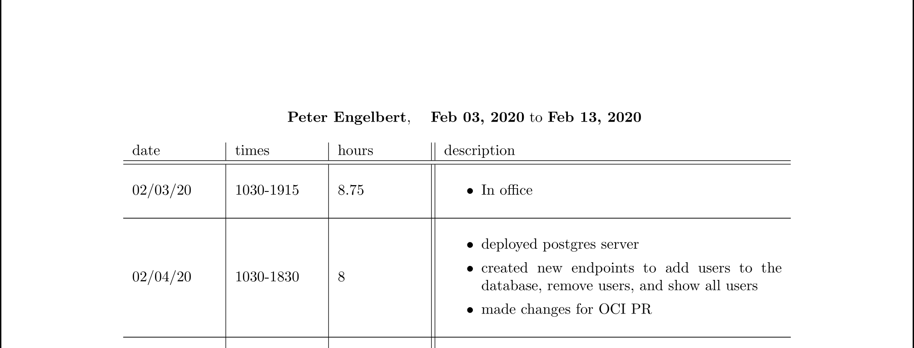

## Timplate
A simple tool that converts a timesheet written in yaml to a nice-looking latex (.tex) document, written in golang.  
Intended for use with the the `pdflatex` tool, which will compile a PDF from the tex file. Never use excel again.
It will auto-calculate your total hours and your pay.

### Dependencies
When compiling to pdf, you will need to install the `pdflatex` tool, usually found in the `texlive` package. 
You will also need the `enumitem.sty` latex package, which is provided in this repository.

### Basic installation
```
git clone https://github.com/pmengelbert/timplate.git
cd timplate
make build
sudo make install
```

### Basic usage
You'll need a yaml file in the following format:
```
name: Arthur Dent
rate: 48
startDate: Feb 03, 2020
endDate: Feb 13, 2020
records:
    - date: 02/03/20
      times: 
          - 1030-1915
      hours: 8.75
      description: 
        - In office
    - date: 02/04/20
      times: 
        - 1030-1830
      hours: 8
      description: 
            - deployed postgres server
            - created new endpoints to add users to the database, remove users, and show all users
            - made changes for OCI PR
```

Then, simply run:
```
timplate <filename.yaml>
```

This will generate `timesheet.tex`, which can be used with pdflatex:
```
pdflatex timesheet.tex
```

Alternatievely, if you have `pdflatex` installed, you can generate the pdf in one go like so:
```
timplate -c <filename.yaml>
```

`pdflatex` will generate timesheet.pdf, which will look like this:

